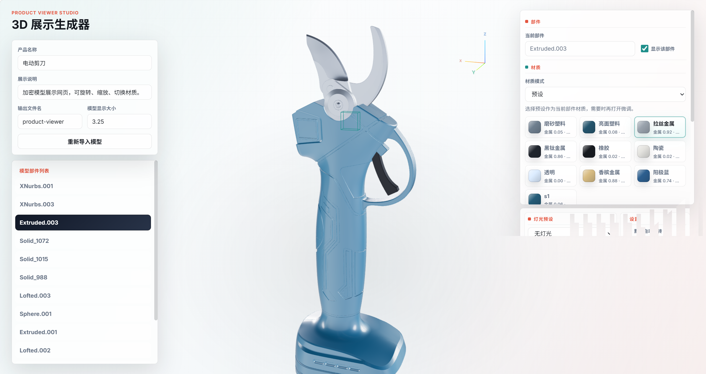
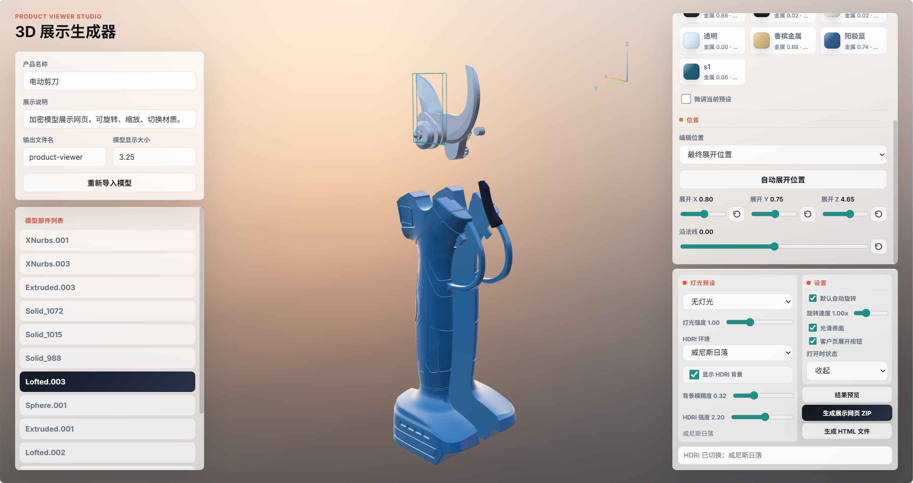
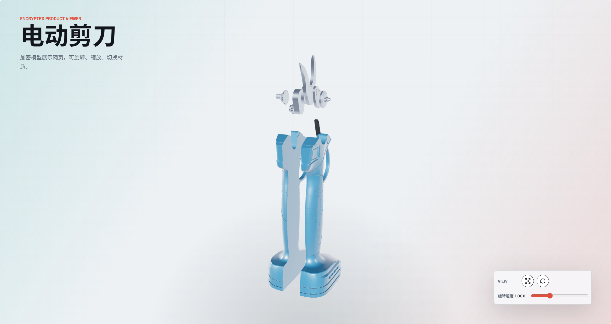
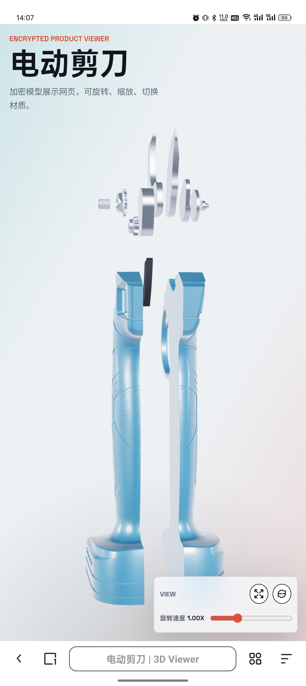

# 3D Product Viewer Builder

一个本地运行的 Three.js 产品展示网页生成工具。导入 `.obj`、`.glb` 或 `.gltf` 模型后，可以在可视化界面里调整材质、灯光、HDRI 环境和部件展开位置，并导出一个可发给客户查看的 3D 展示网页 ZIP。

项目地址：[https://github.com/asuka091241-ai/product-viewer-builder](https://github.com/asuka091241-ai/product-viewer-builder)

## 界面预览

### 材质与部件选择



### 展开位置、灯光和 HDRI



### 客户展示页面



### 手机端展示页面



## 功能

- 支持 OBJ / GLB / GLTF 模型导入
- 中间区域实时预览模型
- 点击模型或部件列表选择部件
- 支持 Shift 多选部件
- 支持原材质、自定义材质和材质预设
- 可调颜色、金属度、粗糙度、透明度
- 支持保存当前材质参数为自定义预设
- 内置多种 HDRI 环境预设
- 可调灯光预设、灯光强度、HDRI 强度
- 可设置客户展示页的默认自动旋转速度，客户页也可继续调节
- 可设置部件手动展开位置
- 支持自动展开，并可在自动展开基础上应用为手动位置
- 支持结果预览
- 一键生成展示网页 ZIP
- 一键生成单文件 HTML
- 导出包包含直接打开版和网站发布版

## 本地运行

这个项目是纯前端工具，建议通过本地 HTTP 服务打开。

```powershell
cd product-viewer-builder
python -m http.server 5182 --bind 127.0.0.1
```

然后在浏览器中打开：

```text
http://127.0.0.1:5182/
```

也可以使用任意静态文件服务器运行本目录。

项目包内也提供了 `使用说明.txt`，里面用更简单的话说明了每种导出方式该怎么交付客户。

## 使用流程

1. 打开工具页面。
2. 点击中间的添加模型区域，导入 OBJ / GLB / GLTF 文件。
3. 在左侧面板选择部件，调整材质、展开位置和自动展开。
4. 在右下区域选择灯光、HDRI 环境和旋转速度。
5. 点击结果预览，确认客户看到的效果。
6. 点击生成 HTML 文件，得到一个可直接发客户的单文件网页。
7. 或点击生成展示网页 ZIP，得到完整展示包。

## 导出包说明

导出的 ZIP 中通常包含：

- `open-directly.html`：单文件直接打开版，适合直接发给客户。
- `index.html`：网站发布版，需要通过 HTTP / HTTPS 服务访问。
- `viewer.js`：展示页逻辑。
- `styles.css`：展示页样式。
- `config.js`：展示配置。
- `assets/product.pkg`：加密后的模型数据。
- `assets/environment.hdr`：导出时使用的 HDRI 环境。
- `README.txt`：客户查看说明。

如果只是发给客户查看，优先使用 `open-directly.html`。如果要放到官网、服务器或对象存储，请上传整个导出文件夹，并访问 `index.html`。

工具页里的生成 HTML 文件按钮，会直接导出一个等同于 `open-directly.html` 的单文件网页。

## 材质与 HDRI

GLB / GLTF 更适合网页展示，模型自带的 PBR 材质、贴图和法线通常能保留得更好。

OBJ 也可以使用，但 OBJ 的材质能力较弱。如果模型在建模软件里是光滑的，网页里却能看到明显分面，可以开启工具里的光滑表面选项。

工具内置 HDRI 预设，用于提供更真实的金属反射和环境光效果。灯光和 HDRI 是叠加关系：灯光负责直接照明，HDRI 负责环境照明和反射。

## 安全边界

导出包会把原始模型转换为加密展示数据，客户不会直接拿到 `.obj`、`.glb` 或 `.gltf` 源文件。

但网页端 3D 展示必须在浏览器里解密后才能渲染，所以这不是绝对防逆向方案。对外展示时建议使用展示版模型，例如适当减面、删除内部结构、去掉生产级细节和敏感尺寸。

## 项目结构

```text
product-viewer-builder/
  index.html
  styles.css
  builder.js
  PRODUCT_VIEWER_DESIGN.md
  使用说明.txt
  docs/
    images/
  assets/
    hdri-presets.js
    *.hdr
```

## 技术栈

- Three.js
- JSZip
- Web Crypto API
- HTML / CSS / JavaScript
